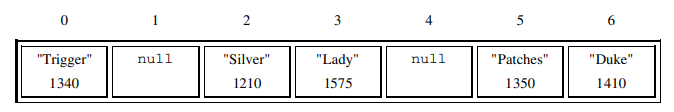
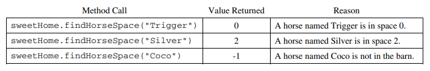
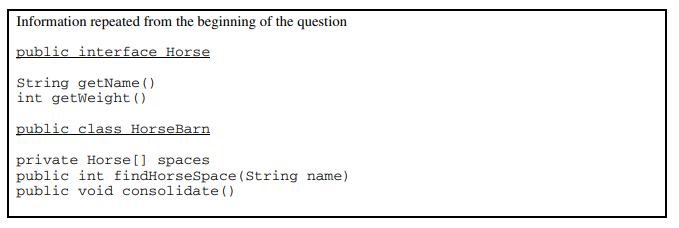
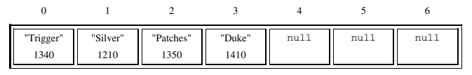

# HorseBarn

Consider a software system that models a horse barn. 

 A horse barn consists of N numbered spaces. Each space can hold at most one horse. The spaces are indexed
starting from 0; the index of the last space is N – 1. No two horses in the barn have the same name.

 The declaration of the HorseBarn class is shown below. You will write two unrelated methods of the
*HorseBarn* class.
```
public class HorseBarn{
 	/** The spaces in the barn. Each array element holds a reference to the horse
	 * that is currently occupying the space. A null value indicates an empty space.
	 */
	 private Horse[] spaces;

  
	 /** Returns the index of the space that contains the horse with the specified name.
	 * Precondition: No two horses in the barn have the same name.
	 * @param name the name of the horse to find
	 * @return the index of the space containing the horse with the specified name;
	 * -1 if no horse with the specified name is in the barn.
	 */
	 public int findHorseSpace(String name)
	 { /* to be implemented in part (a) */ }

  
	 /** Consolidates the barn by moving horses so that the horses are in adjacent spaces,
	 * starting at index 0, with no empty space between any two horses.
	 * Postcondition: The order of the horses is the same as before the consolidation.
	 */
	 public void consolidate()
	 { /* to be implemented in part (b) */ }

  
	 // There may be instance variables, constructors, and methods that are not shown.
	}
```

### Pre-Work
Complete ***Horse*** class.
- *ATTRIBUTES*: name, color, weight
- *METHODS*: constructor, getters, setters, toString


Complete the ***HorseBarn*** class:

* *ATTRIBUTES*: spaces
* *METHODS*:
* constructor
* *addHorse* - assigns a horse to a particular position in the array. Parameters are horse object and index location.
* *findHorseSpace*
* *consolidate*
* *toString* - returns a string "[*horse name*,  *horse name*,  null,  null  ]"
### (a)
Write the *HorseBarn* method *findHorseSpace*. This method returns the index of the space in
which the horse with the specified name is located. If there is no horse with the specified name in the barn,
the method returns -1.

 For example, assume a *HorseBarn* object called *sweetHome* has horses in the following spaces. 
 
 The following table shows the results of several calls to the *findHorseSpace* method. 
 

 

 Complete method *findHorseSpace* .
 ```java
 /** Returns the index of the space that contains the horse with the specified name.
 * Precondition: No two horses in the barn have the same name.
 * @param name the name of the horse to find
 * @return the index of the space containing the horse with the specified name;
 * -1 if no horse with the specified name is in the barn.
 */
 public int findHorseSpace(String name) 
 ```

 ### (b)
 Write the *HorseBarn* method *consolidate*. This method consolidates the barn by moving horses so that the horses are in adjacent spaces, starting at index 0, with no empty spaces between any two horses. After the barn is consolidated, the horses are in the same order as they were before the consolidation.
 
 For example, assume a barn has horses in the following spaces. 

 

The following table shows the arrangement of the horses after *consolidate* is called. 


 

Complete method *consolidate*.
``` java
 /** Consolidates the barn by moving horses so that the horses are in adjacent spaces,
 * starting at index 0, with no empty space between any two horses.
 * Postcondition: The order of the horses is the same as before the consolidation.
 */
 public void consolidate() 
 ```
